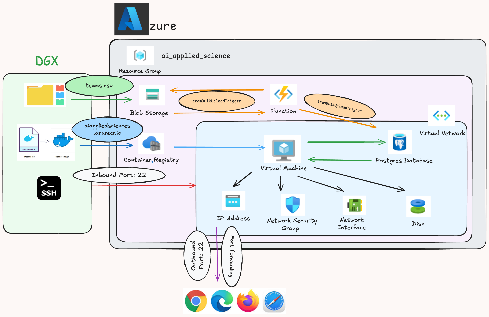
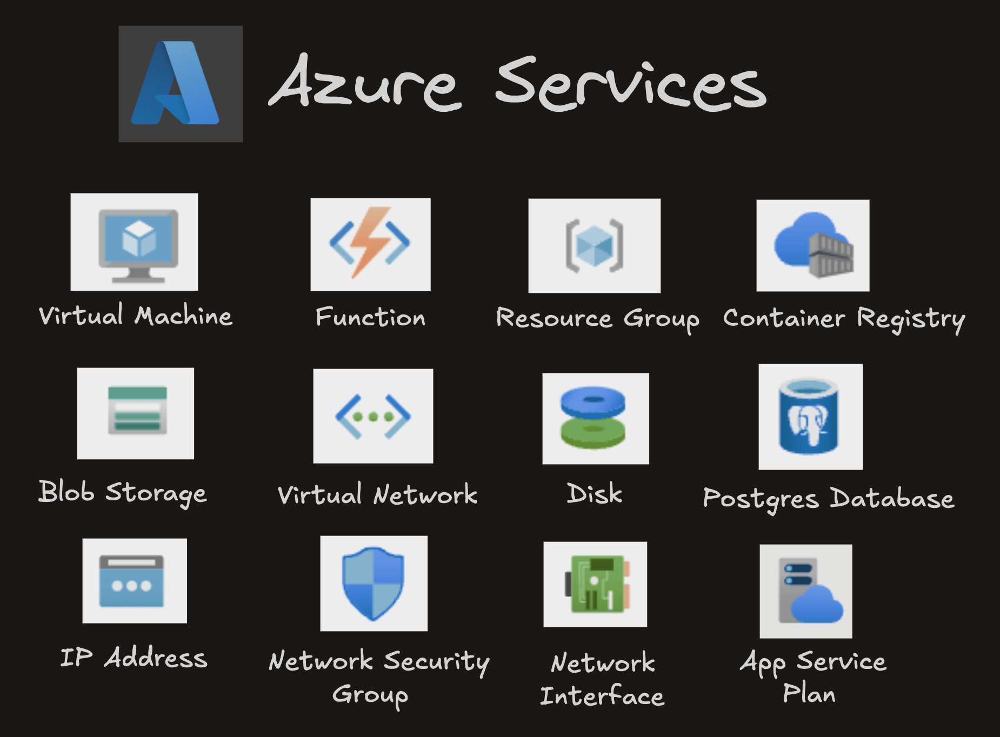

# Azure Demo Project


## Application Architecture



## Azure Services
- **Azure Resource Group**: 

        Azure Resource Group is a container that holds related Azure resources, such as virtual machines, storage accounts, and databases, for easier management and organization.
- **Azure Blob Storage** 
    
        Azure Blob Storage is a service provided by Microsoft Azure that allows you to store and manage large amounts of unstructured data, such as text and binary data
- **Azure Container Registry**: 

        Azure Container Registry (ACR) is a managed Docker container registry service provided by Microsoft Azure.
- **Azure Database for PostgreSQL**: 

        Azure Database for PostgreSQL is a fully managed relational database service provided by Microsoft Azure that offers high availability, automated backups, scaling, and security features for PostgreSQL databases.
- **Azure Function App**: 

        Azure Functions is a serverless computing service provided by Microsoft Azure that allows developers to build and deploy event-driven applications without the need to manage infrastructure
- **Azure Virtual Machine**: 

        Azure Virtual Machines (VMs) is a scalable and flexible cloud computing service provided by Microsoft Azure that allows users to deploy and manage virtualized computing resources in the cloud.
- **Azure Virtual Network**: 

        Azure Virtual Network (VNet) is a logically isolated network in the Azure cloud that allows resources to securely communicate with each other and with on-premises networks
- **Azure Security Group**: 

        Azure Security Group is a set of firewall rules that controls inbound and outbound traffic to resources in a Azure Virtual Network.
- **Azure Network Interface**:

        Network Interface settings configure the network interface of a virtual machine, including IP addresses, network security groups, and connection properties.
- **Azure Public IP**:

        Azure Public IP address is an IP address that is accessible from the internet and is used to expose resources, such as virtual machines, to external networks



## Services Documentation
  -   ### **[Azure Blob Storage Documentation](demoStorage/README.md)**
  -   ### **[Azure Container Registrty Documentation](demoContainerRegistry/README.md)**
  -   ### **[Azure PostgreSQL Database Documentation](demoPostgres/README.md)**
  -   ### **[Azure VM Documentation](demoApp/README.md)**
  -   ### **[Azure Function Documentation](demoAzureFunction/README.md)**


## Running the Application

### On Azure VM
1. SSH into the VM from your Local System (Enabling Port Forwarding on the Application Port)
```shell
ssh -L 15085:localhost:15080 umar-admin@20.174.10.146
# You will be prompted to give your password
umar-admin@20.174.10.146's password:
```

2. Pull the Docker Image from the ACR
```shell
sudo docker pull aiappliedsciences.azurecr.io/team_app:latest     
```

3. Run the docker-compose to start the application
```shell
docker compose -f docker/docker-compose-azure.yaml up -d
```

4. Close the application
```shell
docker compose -f docker/docker-compose-azure.yaml down
```

## On Local System
1. Git Clone the Repo
```shell
git clone https://github.com/umar1997/azure-demo-project.git
```

2. Create a virtual environment and install python libraries
```shell
python3 -m venv demoEnv
```
```shell
source demoEnv/bin/activate
```
```shell
pip install -r requirements.txt
```

3. Create a .env_azure file (Path: ~/azure-demo-project/demoApp/.env)
```shell
POSTGRES_CONNECTION_STRING=postgresql://umar:umar_password@db:5432/demo_postgres_db
BLOB_STORAGE_CONTAINER_NAME=team-data
BLOB_STORAGE_ACCOUNT_NAME=readinggroupstorage
BLOB_STORAGE_ACCOUNT_KEY=LWl*************AStrR5/DQ==
```

4. Build the docker image
```shell
docker build -f docker/Dockerfile.app -t umar/demo_app:base .
```

5. Run the docker-compose to start the application
```shell
docker compose -f docker/docker-compose-local.yaml up -d
```

6. Close the application
```shell
docker compose -f docker/docker-compose-local.yaml down
```
