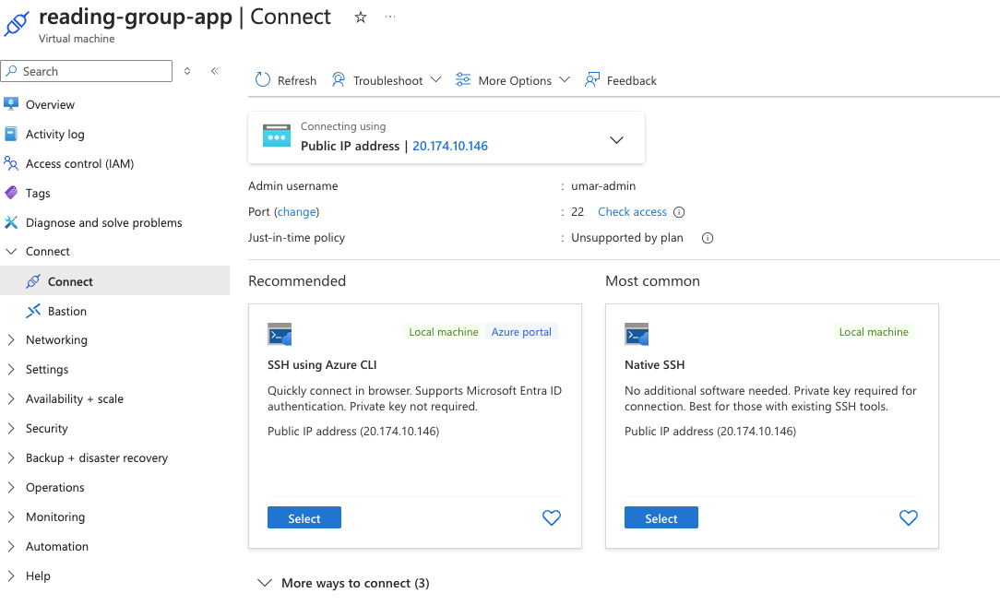

# Azure Virtual Machine

### Goal
> The goal of the project is to create an Azure Virtual Machine and deploy an application onto it


> Azure Virtual Machines (VMs) is a scalable and flexible cloud computing service provided by Microsoft Azure that allows users to deploy and manage virtualized computing resources in the cloud. 

- It enables you to run a wide range of operating systems and applications on virtualized hardware, scaling resources up or down based on demand. 
- Azure VMs are useful for a variety of scenarios, including hosting applications, running development and test environments, and processing large data sets. 
- They offer high availability, robust security features, and seamless integration with other Azure services, providing a cost-effective and efficient solution for dynamic workloads and infrastructure management.

### Set Up
1. Create a Azure Virtual Machine on Azure Portal
<br>
https://portal.azure.com/#create/Microsoft.VirtualMachine-ARM

2. Select different configurations
    - Image for the VM generation
    - VM Architcture (for e.g x64 or Arm64)
    - Sizes of the VM (Virtaul CPUs, GiB memory, and Cost $/month)
    - Authentication Type (Password, SSH Public key)
    - Inbound Port Rules (Ports accessible from the public Internet)
    - Attach a Disk storage
    - Creating **Virtual Network (Vnet)**

        (A Virtual Network (VNet) is a logically isolated network in the cloud that allows resources to securely communicate with each other and with on-premises networks.)
        - Subnet: A subnet is a segment of a Virtual Network that divides the network into smaller, manageable parts and helps organize and secure resources.

        - Security Group: A Security Group is a set of firewall rules that controls inbound and outbound traffic to resources in a Virtual Network.

        - Network Interface Card (NIC) Settings: NIC settings configure the network interface of a virtual machine, including IP addresses, network security groups, and connection properties.

        - Public IP: A Public IP address is an IP address that is accessible from the internet and is used to expose resources, such as virtual machines, to external networks.

3. Once created the following Apps will be created in your RG (Unless for some you chose an already existing service which is in another RG)
    - Virtual Machine
    - Public IP Address
    - Network Security Group
    - Virtual Network
    - Network Interface
    - App Service Plan
    - Disk

4. Can connect through the Portal


5. Using the Admin Username and Password you can SSH
```shell
ssh umar-admin@20.174.10.146
# You will be prompted to give your password
umar-admin@20.174.10.146's password:
```
6. Git is already installed in your VM but you will need to install Docker
7. Set up Docker on your VM 
([YouTube Tutorial Link](https://www.youtube.com/watch?v=UM0f76-0FLI))
```shell
# Link: https://docs.docker.com/engine/install/ubuntu/

sudo apt-get update
sudo apt-get install ca-certificates curl
sudo install -m 0755 -d /etc/apt/keyrings
sudo curl -fsSL https://download.docker.com/linux/ubuntu/gpg -o /etc/apt/keyrings/docker.asc
sudo chmod a+r /etc/apt/keyrings/docker.asc

# Add the repository to Apt sources:
echo \
  "deb [arch=$(dpkg --print-architecture) signed-by=/etc/apt/keyrings/docker.asc] https://download.docker.com/linux/ubuntu \
  $(. /etc/os-release && echo "$VERSION_CODENAME") stable" | \
  sudo tee /etc/apt/sources.list.d/docker.list > /dev/null


sudo apt-get update

sudo apt-get install docker-ce docker-ce-cli containerd.io docker-buildx-plugin docker-compose-plugin
```
>> Note: You will have to use sudo docker to run commands or add User to the docker group

8. Install Azure CLI (Maybe another way to pull images from ACR in Azure VM)
```shell
curl -sL https://aka.ms/InstallAzureCLIDeb | sudo bash
```
9. Login to ACR
```shell
# az login --tenant <TENANT-ID> --use-device-code
sudo az acr login --name aiappliedsciences
# You are then prompted with Username and Password
Username: AIAppliedSciences
Password: <password>
Login Succeeded
```
10. Pull docker image that you pushed 
```shell
sudo docker pull aiappliedsciences.azurecr.io/nginx:latest
```

11. To port forward the application port
```shell
ssh -L 15085:localhost:15080 umar-admin@20.174.10.146
```
