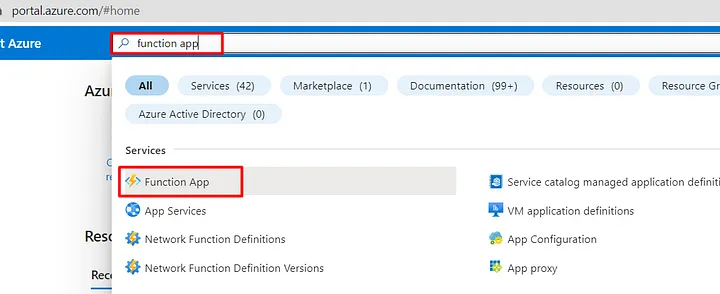
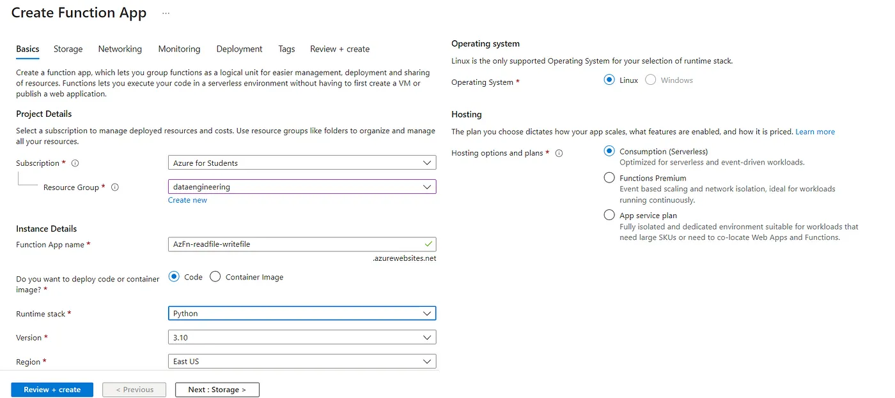
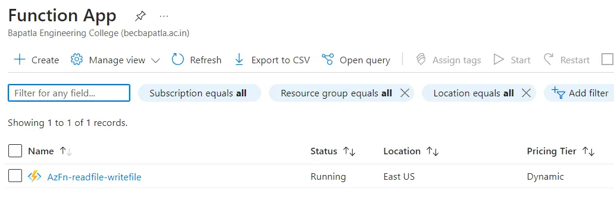
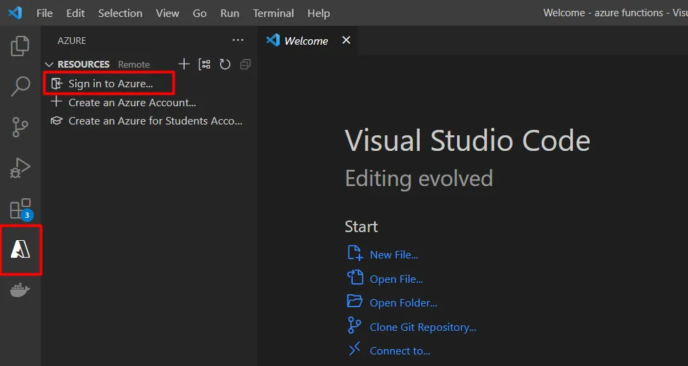
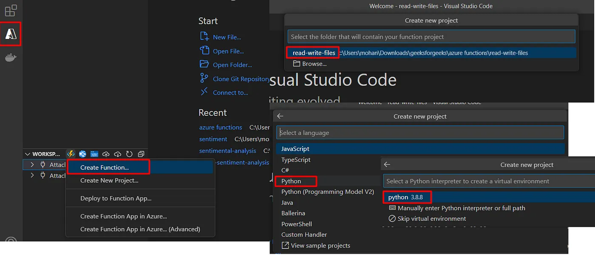
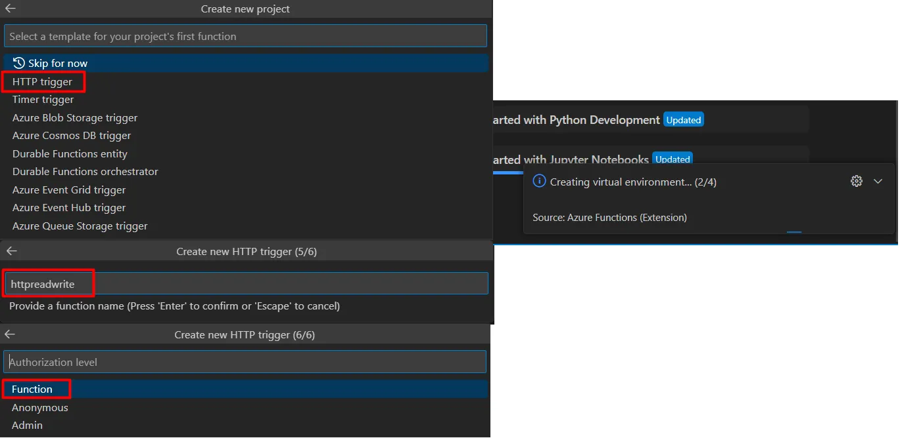
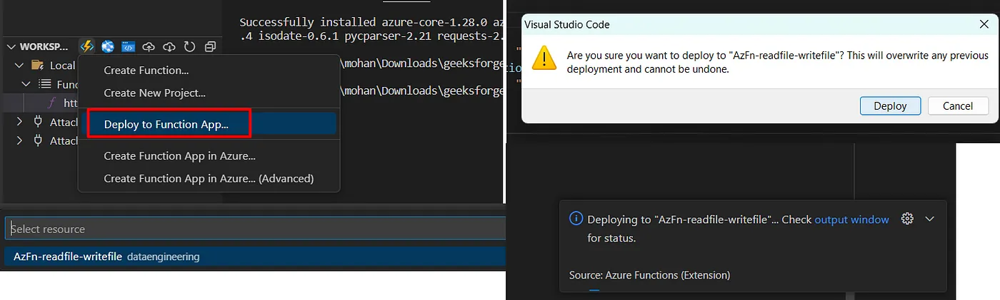
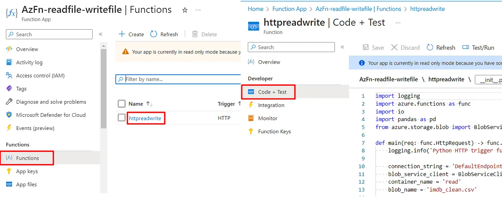
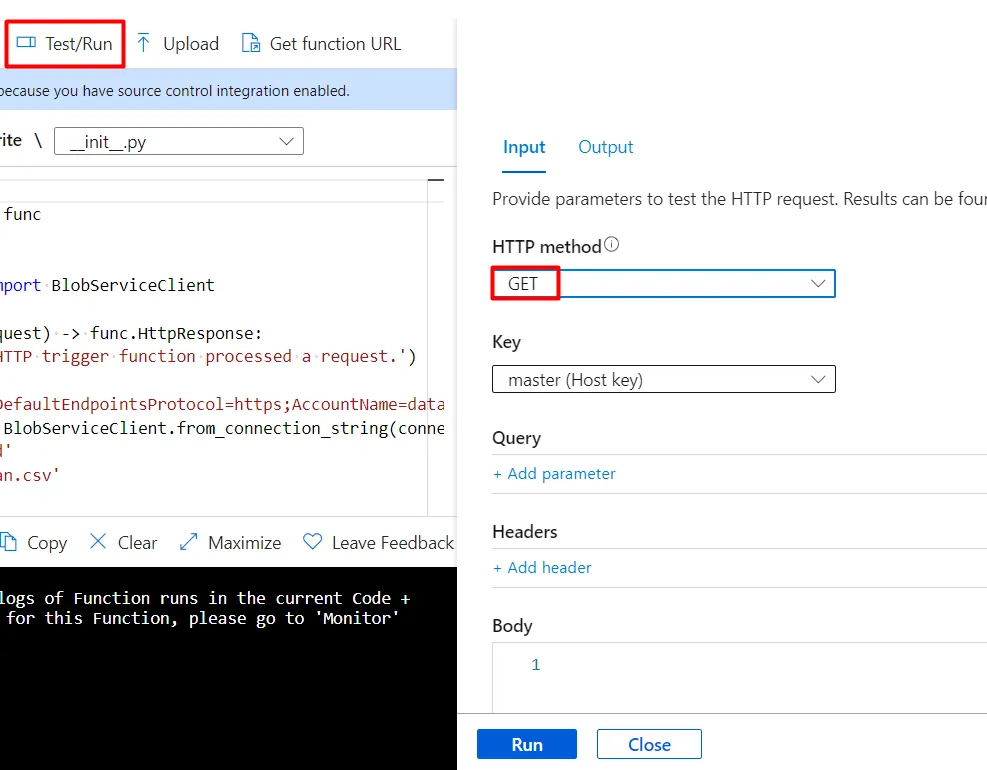

# Azure Function

### Goal
> The goal of the project is to create a Blob Storage and upload some files onto it

> Azure Functions is a serverless computing service provided by Microsoft Azure that allows developers to build and deploy event-driven applications without the need to manage infrastructure

- With Azure Functions, developers can focus solely on writing code to handle specific events, leaving the underlying infrastructure and scaling aspects to the Azure platform. This enables faster development, reduced operational costs, and enhanced scalability.

- **Key Features of Azure Functions**:
    1. Event-driven Computing: Azure Functions are triggered by various events, such as HTTP requests, timers, messages in queues, file uploads, or changes to data in databases
    2. Serverless Architecture: Azure Functions follows the serverless computing paradigm, meaning there are no servers to provision or manage. The platform automatically handles infrastructure scaling and ensuring resources.
    3. Language and Platform Support: Azure Functions supports multiple programming languages 
    4. Pay-as-You-Go Pricing: Azure Functions offer a pay-as-you-go billing model. You only pay for the compute resources used during the execution of your functions.
    5. Integration with Azure Services

- **Types of Azure Function**:
    1. HTTP Trigger
    2. Timer Trigger
    3. Blob Trigger
    4. Queue Trigger
    5. Event Grid Trigger
    6. Cosmos DB Trigger
    7. Service Bus Trigger
    8. Event Hub Trigger

### Set Up
1. Create an Azure function in Azure cloud
 
https://portal.azure.com/#create/Microsoft.FunctionApp

2. View the Hosting options and plans

3. After deployment is done, got function app and check whether the resource is created or not.

4. Install the Azure extension oon VS code and sign in to your Azure account.

5. Create Function project, selecting the folder containing the function and programming langauge

5. Select the type of trigger we want to create, function name, and authorization level

6. It creates the files for the Function App (If the Project isnt already not created otherwise)
    - .venv
    - .funcignore
    - function_app.py
    - host.json
    - local.settings.json
    - requirements.txt

7. Deploy the function App to the Azure cloud.

8. Open the Azure function and run it.

9. Tutorial Link: https://mohan-balaji.medium.com/getting-started-with-azure-functions-a-step-by-step-guide-e18f16764017