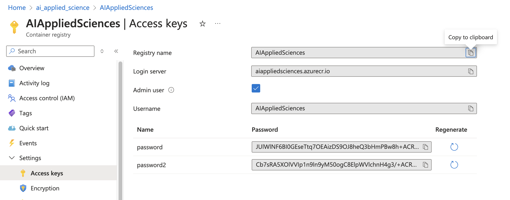
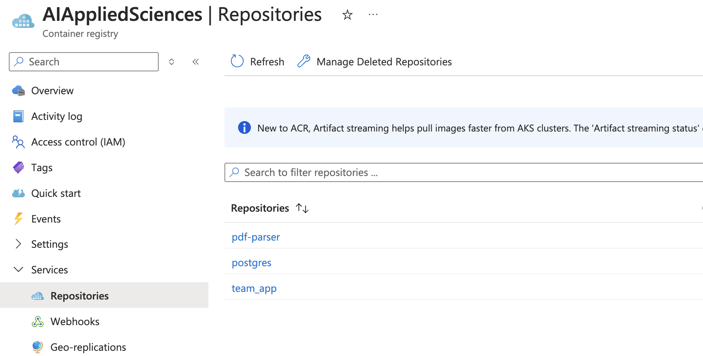

# Azure Container Registry

### Goal
> The goal of the project is to create an Azure Container Registry and push a docker image onto a Azure virtual machine


> Azure Container Registry (ACR) is a managed Docker container registry service provided by Microsoft Azure. It allows organizations to securely store, manage, and deploy container images and artifacts in a private, scalable, and highly available registry. 

- ACR integrates seamlessly with Azure Kubernetes Service (AKS) and other Azure services, providing features like automated image builds, security scanning, and role-based access control. 
- Its importance lies in simplifying the management of containerized applications, enabling efficient deployment pipelines, and enhancing security and compliance by keeping container images within a controlled environment.

### Set Up
1. There are 2 ways in which you can create an ACR (`Portal` or `Code`)
2. Create an ACR by running these commands to create an ACR
```shell
az login
az group create --name myResourceGroup --location eastus
az acr create --resource-group myResourceGroup --name myacrregistry --sku Basic
az acr login --name myacrregistry

# Tag your docker image
docker tag my-app:latest myacrregistry.azurecr.io/my-app:latest

# Push the docker image
docker push myacrregistry.azurecr.io/my-app:latest

# List Repositories
az acr repository list --name myacrregistry --output table
# List Tags in a Repository
az acr repository show-tags --name myacrregistry --repository my-app --output table
```

3. Create a Azure Container Registry on Azure Portal (Recommended)
<br>
[https://portal.azure.com/#create/Microsoft.ContainerRegistry](https://portal.azure.com/#create/Microsoft.ContainerRegistry)

4. Create the docker image
```shell
docker build -f Dockerfile -t umar/<some-image-name>:latest

# We will use umar/nginx:latest a72860cb95fd
```
5. Get the `username`, `password` and `login server` from the Portal
```python
# Credentials
Registry name       AIAppliedSciences
Login server        aiappliedsciences.azurecr.io
Username            AIAppliedSciences
Password            <password>
```


6. Authenticate with a Docker registry
```shell
docker login aiappliedsciences.azurecr.io
Username: AIAppliedSciences
Password: <Password>
```
You will get a `Login Succeeded` message 

7. Tag the docker image and push to ACR
<br>
[YouTube Tutorial Link](https://youtu.be/HAj1u7CShSw?si=6GSH_a3YaB5kh_3F)

```shell
docker tag a72860cb95fd aiappliedsciences.azurecr.io/nginx
docker push aiappliedsciences.azurecr.io/nginx
```
