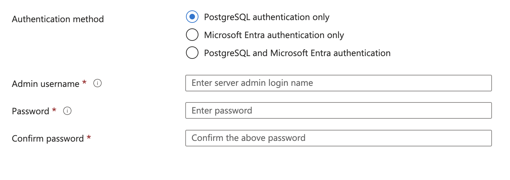
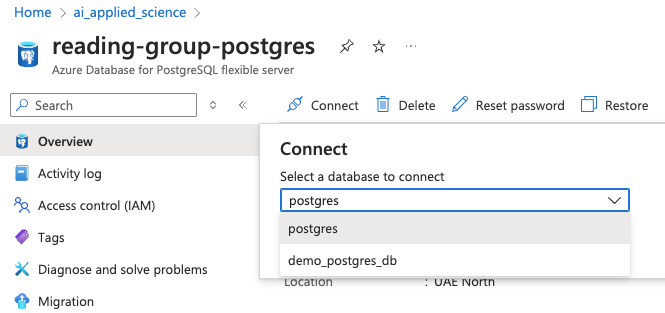
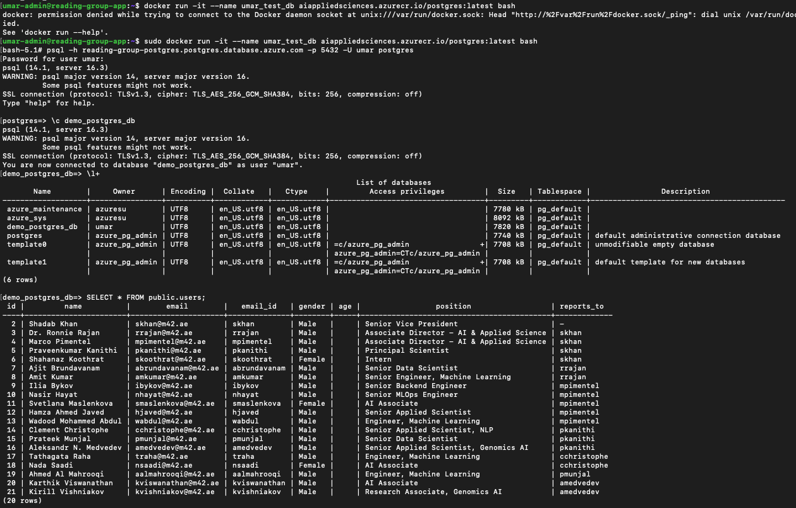

# Azure Database for PostgreSQL

### Goal
> The goal of the project is to create an Azure Database for PostgreSQL and be able to connect to it.


> Azure Database for PostgreSQL is a fully managed relational database service provided by Microsoft Azure that offers high availability, automated backups, scaling, and security features for PostgreSQL databases. 

- It simplifies database management by handling routine tasks such as patching, backups, and monitoring, allowing developers to focus on building and optimizing applications. 
- The service supports advanced PostgreSQL features like JSONB, full-text search, and spatial data, and integrates seamlessly with other Azure services. 
- Its usefulness lies in providing a reliable, scalable, and secure environment for PostgreSQL workloads, reducing administrative overhead and enhancing operational efficiency.

### Set Up
1. Create a Azure Database for PostgreSQL on Azure Portal
<br>
https://portal.azure.com/#create/Microsoft.PostgreSQLFlexibleServer

2. Enter your Username and Password to access the DB


3. Can connect through the Portal which will open up a Cloud Shell


4. Connect to the PostgreSQL server using the command below, either through the PostgreSQL command-line client or by trying Azure Cloud Shell.
```shell
psql -h reading-group-postgres.postgres.database.azure.com -p 5432 -U umar postgres
# Password for user umar: 
```
5. Run commands on Postgres to see everything is working fine.

